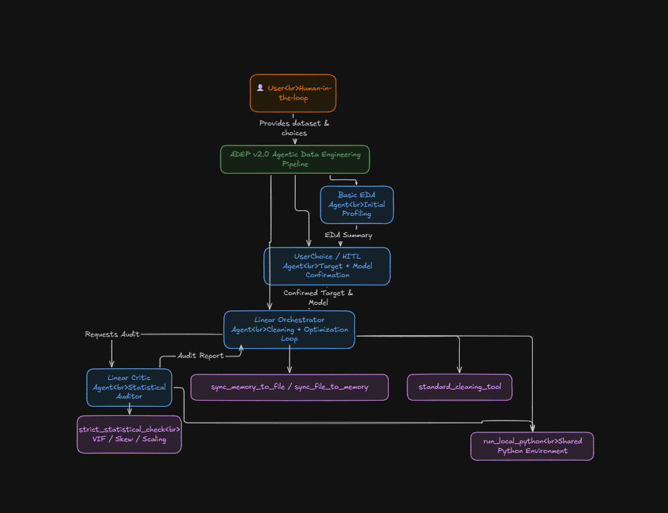
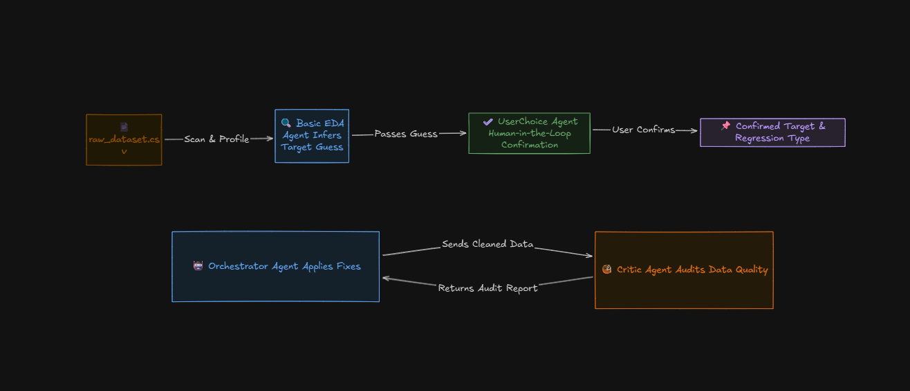
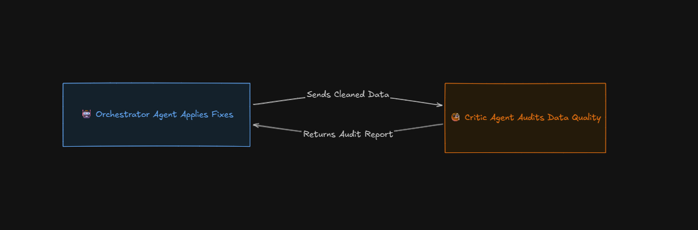

# 🚀 ADEP — Agentic Data Engineering Pipeline
### *Automated EDA, Cleaning, and Feature Engineering using Google ADK + Multi-Agent Systems*

  
   
  <em>High-Level Architecture of ADEP</em>

---

## 🧩 1. Problem Statement

Machine learning workflows spend **over 70% of development time** on data preparation tasks such as:
* Cleaning & Fixing missing values
* Outlier removal & Skew correction
* Multicollinearity resolution
* Scaling & encoding
* Ensuring regression assumptions

Most automated cleaning systems available today are:
* ❌ **Black-box**
* ❌ **Non-explainable**
* ❌ **Statistically weak**
* ❌ **Not reproducible**
* ❌ **Lacking human control**

---

## 🎯 2. ADEP: The Solution

**ADEP (Agentic Data Engineering Pipeline)** is a transparent, auditable, multi-agent data preparation system powered by **Google ADK**.

Unlike black-box tools, ADEP is a **collaborative agentic system** that performs:
* ✅ **Intelligent EDA**
* ✅ **Human-in-the-loop (HITL)** target confirmation
* ✅ **Iterative regression readiness checks**
* ✅ **Statistical fixes** (VIF reduction, Log transforms, Scaling, Logic checks)
* ✅ **Fully reproducible transformations**
* ✅ **Logging + Observability** at every step

---

## 🏗️ 3. Architecture

ADEP relies on a directed cyclic graph of specialized agents.

  
   
  <em>High-Level Architecture of ADEP</em>

### 🧠 4. Agent Responsibilities

| Agent | Purpose | Description |
| :--- | :--- | :--- |
| **BasicEDA Agent** | Data Scanner | Reads raw file, detects structure, data types, potential outliers, and provides an initial target guess. |
| **UserChoice Agent** | HITL Decision Maker | Pauses execution to allow the user to confirm the target variable and regression type (Linear/Logistic). |
| **Orchestrator Agent** | Data Engineer | Applies cleaning logic, VIF fixes, skew corrections, scaling, and encoding based on feedback. |
| **Strict Critic Agent** | Statistical Auditor | Uses `strict_statistical_check` only. Ensures regression readiness (VIF, Normality, etc.). |
| **Observability Engine** | Logging System | Logs every agent "thought" and "action" to both the console and a trace file. |

## 🔄 5. Pipeline Workflow

### Step 1: Raw Data → BasicEDA Agent
The system reads the CSV, prints the structure, suggests a target variable, and identifies early data quality issues.

### Step 2: Human-in-the-Loop (HITL)
The system does not guess blindly. The **UserChoice Agent** pauses to ask:
> "Is price your target variable?"
> "Should we run linear or logistic regression?"

You remain in control of the experiment setup.

### Step 3: Orchestrator ↔ Critic Loop

  
   
  <em>High-Level Architecture of ADEP</em>

This loop continues until:
* All regression violations are fixed (**Verdict: READY**), OR
* The anti-looping mechanism stops infinite adjustments (**Verdict: BEST EFFORT**).

### Step 4: Finalization
ADEP saves the final artifacts:
* `linear_ready_train.csv`
* `cleaning_report.md`
* `agent_trace.log`

And outputs the final status:

"""
DATA CLEANING COMPLETE (Perfect)
// or
DATA CLEANING COMPLETE (Best Effort)"""

### 🔄 5. Pipeline Workflow

automatedEDA/
│
├── agents/
│   ├── basic_eda_agent.py
│   ├── user_choice_agent.py
│   ├── linear_orchestrator_agent.py
│   └── strict_critic_agent.py
│
├── tools/
│   ├── strict_statistical_check.py
│   ├── run_local_python.py
│   └── cleaning_tools.py
│
├── utils/
│   ├── shared_environment.py
│   ├── observability.py
│
├── data/
│   ├── raw_dataset.csv
│   ├── processed/
│   │       └── linear_ready_train.csv
│
├── cleaning_report.md
├── agent_trace.log
├── main.py
└── README.md

## ⚙️ 7. Installation

1. **Clone the repository**
   
   git clonehttps://github.com/Allen203060/automatedEDA
   cd automatedEDA/

2. **Create virtual environment**
    python3 -m venv venv
    source venv/bin/activate    # Mac/Linux
    venv\Scripts\activate       # Windows
    
3. **Install dependencies**
    pip install -r requirements.txt

4. **Export Google ADK credentials**
    export GOOGLE_ADK_KEY="your_api_key"

5. **Run the engine**
    python main.py

## ▶️ 8. Running ADEP

Running `python main.py` will:
* Start BasicEDA
* Launch HITL dialogue
* Engage Orchestrator ↔ Critic loops
* Save dataset and report
* Log everything

**Example Console Output:**
"""
[EDA] Suggested Target: price
[HITL] Confirm the target variable: price
[ORCH] Fixing VIF: dropping rad
[CRITIC] High skew in black (Skew=4.47)
...
DATA CLEANING COMPLETE (Perfect)"""

## 📊 9. Expected Outputs

**1. Final Clean Dataset**
Located at: `data/processed/linear_ready_train.csv`

**2. Cleaning Report Example (`cleaning_report.md`)**

"""
# Cleaning Report

✔ Standard cleaning performed (NaNs filled, outliers removed).  
✔ Removed columns: `rad`, `nox` (multicollinearity via VIF).  
✔ Applied log/square transforms to reduce skewness (`crim`, `zn`, `black`).  
✔ Scaling applied to standardized predictors.  

### Remaining Issues
Some features retain mild skew due to anti-looping protection."""

**3. Full Agent Log**
Located at: `agent_trace.log` (Contains detailed "Thoughts" and "Tool Calls").